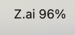

# zai_token_widget

Menu bar app for macOS that shows **Z.AI** GLM coding plan quota (remaining **%** from the [usage API](https://api.z.ai)).



## Requirements

- macOS 14+
- Swift toolchain (Xcode or Command Line Tools)

## Run

```bash
git clone https://github.com/bibstha/zai_token_widget.git
cd zai_token_widget
./run.sh
```

That builds a release binary, packages `ZaiTokenWidget.app`, and opens it. The item appears on the **right** side of the menu bar.

**Manual build:**

```bash
swift build -c release
./package_app.sh
open ZaiTokenWidget.app
```

## API key

1. Create or copy a key from [Z.AI API keys](https://z.ai/manage-apikey/apikey-list).
2. **Preferences…** (⌘,) from the menu bar item and paste it — it is stored in the **login keychain**.

Or set **`ZAI_API_KEY`** or **`GLM_API_KEY`** in your environment before launch.

## Behaviour

- Fetches quota on launch, then **every 5 minutes** (use **Refresh** in the menu anytime).
- On macOS 26 (Tahoe), launch the **`.app`** (`open`, Finder, or `./run.sh`). Avoid running the raw binary from Terminal and pressing **Ctrl+C**, which quits the app.
