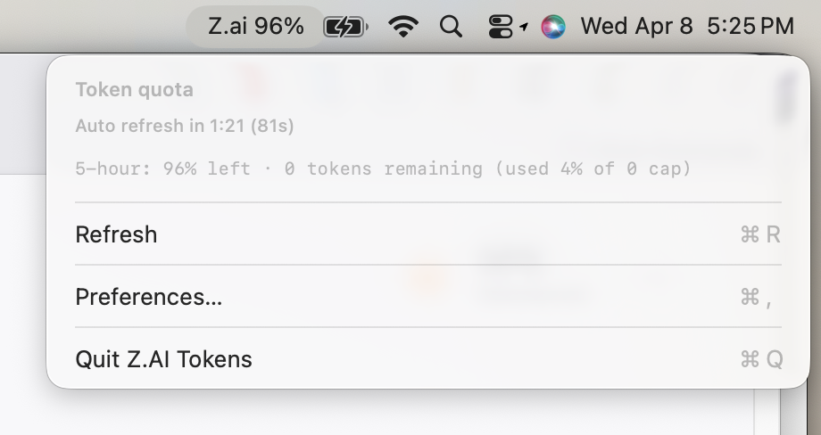

# llm-mac-widget

Menu bar app for macOS that shows:

- **Z.AI** GLM coding plan quota (remaining **%** from the [Z.AI usage API](https://api.z.ai))
- **Claude Code / Claude Max** session quota (remaining **%** in the current 5-hour window, from Anthropic’s OAuth usage API — the same session data as `claude` after you sign in)

The app was **built entirely using [Cursor](https://cursor.com)** (AI-assisted development in the editor).

Your **Z.AI API key** is **stored in the macOS login keychain** when you save it in Preferences (generic password for this app — not in files, not in git). **Claude** does not use a key from this app: it reuses the OAuth session the **Claude Code** CLI stores under `~/.claude/.credentials.json`, the Keychain item **Claude Code-credentials**, or optional env vars **`CLAUDE_CODE_OAUTH_TOKEN`** / **`CLAUDE_OAUTH_TOKEN`** (same idea as [ClaudeBar](https://github.com/tddworks/ClaudeBar)).



## Requirements

- macOS 14+
- Swift toolchain (Xcode or Command Line Tools)

## Run

```bash
git clone https://github.com/bibstha/llm-mac-widget.git
cd llm-mac-widget
./run.sh
```

That builds a release binary, packages `LlmTokenWidget.app`, and opens it. The item appears on the **right** side of the menu bar.

**Manual build:**

```bash
swift build -c release
./package_app.sh
open LlmTokenWidget.app
```

## Credentials

### Z.AI

1. Create or copy a key from [Z.AI API keys](https://z.ai/manage-apikey/apikey-list).
2. **Preferences…** (⌘,) from the menu bar item and paste it. It is saved to the **login keychain** (you can inspect or delete it in **Keychain Access** if needed).

Or set **`ZAI_API_KEY`** or **`GLM_API_KEY`** in your environment instead (not stored in the keychain).

### Claude Code / Max

Sign in with the **`claude`** CLI (`claude login` or equivalent). The widget reads the same OAuth credentials as the CLI. If the menu shows **CC:—**, confirm `~/.claude/.credentials.json` exists and is readable, or that **Claude Code-credentials** appears in Keychain Access. You can also set **`CLAUDE_CODE_OAUTH_TOKEN`** (or **`CLAUDE_OAUTH_TOKEN`**) in the environment when launching the app from a shell — Finder-launched apps do not inherit shell exports.

## Behaviour

- Fetches **both** quotas on launch, then **every 5 minutes** (use **Refresh** in the menu anytime). The menu bar title shows **Z:** and **CC:** fragments (e.g. `Z:96% CC:85%`).
- On macOS 26 (Tahoe), launch the **`.app`** (`open`, Finder, or `./run.sh`). Avoid running the raw binary from Terminal and pressing **Ctrl+C**, which quits the app.
